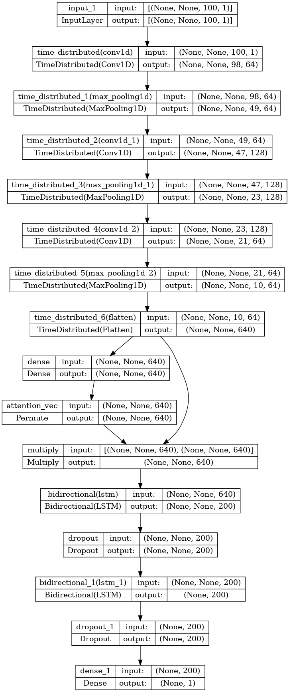
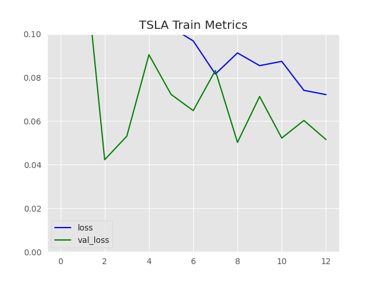
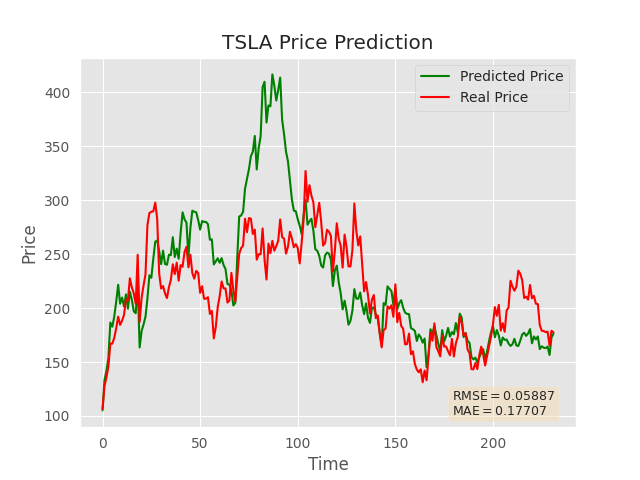

# CNN-LSTM-Stock

##Package dependence
tensorflow==2.9.2

## Data
We use the US-stock from Yahoo Finance and Index data from MarketWatch. From 2017-09-01 to 2022-08-31. We predict the stock/index using the close price.

For stock:
We use GOOG,TSLA

For Index:
We use S&P 500

## Use
One need to specify "stock" or "index" and stock or index name in the command line

For example

```
python test.py stock GOOG
```

```
python test.py index SP500
```
to predict SP500
## Neutral Network Structure
We use a CNN-LSTM based model to predict stock with an attention layer. We start with three 1D Convolution layers with max pooling layers and then connect the two LSTM layers with an attention layer. To avoid overfitting, we added two drop out layers. During training, we also use early stopping. Here's the full Neutral network structure. 



## Training and Testing Result



